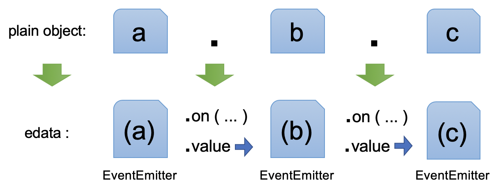

# EDATA (Enhanced DATA)

**edata** is the nested observable reactive [EventEmitter](https://github.com/futurist/mitt) with `.value` getter/setter, lodash style path, and keep [Event Sourcing](https://martinfowler.com/eaaDev/EventSourcing.html) in mind.

It roughly referenced [Object.observe API](https://developer.mozilla.org/en-US/docs/Web/JavaScript/Reference/Global_Objects/Object/observe), but instead using [getter/setter](https://developer.mozilla.org/en-US/docs/Web/JavaScript/Guide/Working_with_Objects#Defining_getters_and_setters) to wrap object, lightweight than [Proxy](https://developer.mozilla.org/en-US/docs/Web/JavaScript/Reference/Global_Objects/Proxy).

[](https://travis-ci.org/futurist/edata)
[](https://www.npmjs.com/package/edata)

<!-- toc -->

- [Install](#install)
- [Usage](#usage)
  * [- Quick Start](#--quick-start)
  * [- Flat data](#--flat-data)
  * [- Observe root changes](#--observe-root-changes)
  * [- Define Data Relations](#--define-data-relations)
  * [- Use in React](#--use-in-react)
- [API](#api)
    + [- import library](#--import-library)
    + [- initialize](#--initialize)
    + [- .get](#--get)
    + [- .set](#--set)
    + [- .getset](#--getset)
    + [- .unset](#--unset)
    + [- .unwrap](#--unwrap)
    + [- .slice](#--slice)
    + [- .context](#--context)
    + [- .push](#--push)
    + [- .pop](#--pop)
- [plugins](#plugins)
  * [`plugins/set-many`](#pluginsset-many)
    + [- .setMany](#--setmany)
  * [`plugins/actions`](#pluginsactions)
    + [- .dispatch](#--dispatch)

<!-- tocstop -->

## Install

**NPM**
```sh
npm install --save edata
```

```js
import edata from 'edata'
```

## Usage

### - Quick Start


**Below can give you a quick idea of edata:**

```js
var root = edata()({a: {b: {c: {}}}})
// plain_object ---> edata
```



**Complete example:**

```js
import edata from 'edata'
const root = edata({ /* options */ })({
    age: 20,
    firstName: 'Hello',
    lastName: 'World',
    address: {
        city: 'Earth'
    }
})
const callback = ({type, path}) => console.log(`--> ${type}: ${path}`)
root.observer.map(callback)
root.set('address.city', 'Moon') // LOG: --> update: ['address', 'city']
root.get('address.city').value // Moon
```

**Plain object wrapped into edata:**

> edata = EventEmitter(object)

so use `edata.on` can watch changes, use `edata.value`(getter/setter) to get nested edata.

```js
root.value.firstName.value  // get -> firstName
root.value.firstName.value = 'name'  // set -> firstName
root.value.address.value.city.on('change', callback)  // watch on 'change'
```

**Can also use lodash style:**

```js
root.get('firstName').value  // get: firstName
root.set('firstName', 'name')  // set: firstName
root.get('address.city').on('change', ...) // watch change
```

**The callback of `change` event:**

```js
root.get('firstName').on('change', ({path, type, data})=>{
    console.log(path, type, 'to: ' + data)
})
root.set('firstName', 'Hi')
//[LOG] firstName update to: Hi
```

> Note: `edata.on('change', callback)` has shortcut: `edata.map(callback)`

**Operation with .valueOf**

`edata.valueOf()` method returns `.value`, so below are same:

```js
root.get('age').value + 10  // 30

// same as:
root.get('age') + 10  // 30
```

### - Flat data

Since the edata objects nested as **EventEmitter**, you can flat this structure into plain object using `edata.unwrap()`:

```js
root.unwrap()
// flat root: {age: 20, firstName: 'Hello', lastName: 'World', address: {city: 'Earth'}}

root.unwrap('address')
// flat address: {city: 'Earth'}

root.unset('address')
// delete address

root.unwrap()
// {age: 20, firstName: 'Hello', lastName: 'World'}
```

### - Observe root changes

The root has a `observer` attribute, which is also an edata itself, you can callback for every changes.

**start observe changes** of root
```js
const onDataChange = ({data, type, path})=>{
    console.log('value mutated:', path, type, data.unwrap())
}
root.observer.on('change', onDataChange)

root.set('address.city', 'Mars')
// [LOG] data mutated: [ 'address', 'city' ] add Mars
root.get('address.city').value = 'Earth'
// [LOG] data mutated: [ 'address', 'city' ] update Earth
root.unset('address.city')
// [LOG] data mutated: [ 'address', 'city' ] delete Earth
```

to **stop observing**, you can `.off()`
```js
root.observer.off('change', onDataChange)
```

### - Define Data Relations

You can define data relations using `setComputed`, as below:

```js
const root = edata()({
  firstName: 'Hello',
  lastName: 'World'
})
root.setComputed(
  'fullName',
  ['firstName', 'lastName'],
  ([firstName, lastName]) => firstName + ' ' + lastName
)
assert.equal(root.unwrap('fullName'), 'Hello World')
root.set('firstName', 'Green')
assert.equal(root.unwrap('fullName'), 'Green World')
```

### - Use in React

```js
const root = edata()({user: {name: 'earth'}})

class App extends React.Component {
    constructor(props){
        super(props)
        const {model} = this.props
        this.state = model.unwrap()
        // init: {name: 'earth'}
        
        this.onInputChange = e => {
            const {name, value} = e.target
            model.set(name, value)
        }
        
        this.onModelChange = ()=>{
            this.setState(model.unwrap())
        }
    }

    componentDidMount(){
        model.observer.on('change', this.onModelChange)
    }
  
    componentWillUnmount(){
        model.observer.off('change', this.onModelChange)
    }
    
    render(){
        const {model} = this.props
        const userName = model.unwrap('name')
        return <div>
            <h3>Hello {userName}</h3>
            <input name='name' value={userName} onChange={this.onInputChange} />
        </div>
    }
}

ReactDOM.render(<App model={root.slice('user')} />, app)

```

You can play with the [demo here](https://flems.io/#0=N4IgZglgNgpgziAXAbVAOwIYFsZJAOgAsAXLKEAGhAGMB7NYmBvAHgBMIA3AAgjYF4AOiAwAHUcIB8LAPQdOkkAF8K6bLkQEAVgip0GTYnn1xi3LLTYwo3ftxhsMxDPitgMAVyjEAFAEofYA84GAAnRG5gTBwIgHIYDFDiQlilJT9BNEzqKAw4OG4AQXF7AA9GNDYCgCUE6mJ8AGFaLFF6Q0jM7m7uE2JQj3raUJ9RUNpROD9gLp65uA9RMNHxyYy0Obm+yIsrKCVbbmSIOHwxibhZzaPCE-xTJxhD3et8DzQAd1CxfyvNmRkkWiMDiCSSKSUfzmUJ6x1O9AAkmhRB5iI1CBg0ABzJ52XGSToba6bbZRdQUbicDBQDwwA54-DOUI44gw64vKD3GC+YEUqk0mDrYncSFE65sm53egAWUs1nRmJxh0CjmcFOIAE8lhTRE5COl+JIZmLhZLTiFiABlZyMQIS4XIXXJAC6EVVLn5tPtPXSEtFc1FfzorXaDAAInxZe9fNMJRz8NQMdiYPh6D5Yu7YurbvC0LK9grk0KfbMgy02mhDAB1aBQACqaAs0f8xuF8cTipTtDAYHTmezUrzcqghZxxe6-p6f1CTCsI1jJq29FMO2H9LNZ1Wl0XPW2wTCADl1M9h29Pt9ROngbFx5sZ8QPKENuwuJJvd0WIQAMySAAS1igWhIn3UIjxwJRZG-N8d2uFgIGRVFuGBfhYmvSlqVpfgghCUD1AOehRxgLC4VTNAkRRNEkxxA4ZGg4VZHkOiSzQQM0FqDB6jDAB5aV8BnSplhYYpRHMYcsPjOAoAgagYHTECbxoyQKTEUR1koGhy2gMI8AAIwwHTrHUkJYHqCBlzwABGRAAAZlFUEBgTwBN8nU-QKiMTRlGdKgpLQABrBAUDUHA8BnDiGisThrAmHAGHwHR1MfchNBIYhJkQAF3lEPysQTFoZDC+oZA8LA2AKuoIpgKLANEWKGgSqhNSWPA4GoUIIFEIwVGCjQQEK4gAFo2BaVwqui2rDHi3QQCSvBUvSzLkRyvKsHK8Khvykqyv6jasFG6qYsmhqQCa3rWvazq7J6vAHCcDBEtCZKQHmuAMuKpbcuDGRbucAABaz8As-AvzkE5iGK0qpvU06WrajqjCoYyYFM8zNC-RALIATgG9GACYABYvKUIA)


## API

#### - import library

**For ES6 Module**

```js
import edata, {DefaultBaseClass} from 'edata'
const root = edata()(initData)
```

> The lib expose a default `edata` function to use

The `DefaultBaseClass` can be used for sub-class your own implemention of `edata`.

You can `extends` this class to add your own methods:

```js
class MyBaseClass extends DefaultBaseClass {
    my_method(){
        // do sth.
    }
}
const root = edata({ baseClass: MyBaseClass })(initData);
root.my_method();
```

**For CommonJS module**

```js
const edata = require('edata').default
const root = edata()(initData)
```

**Notice**

Be careful when using `class` keyword, by default, you have to transpile your code to `ES5` to run correctly.

If you need to use `class` without transpile, you should import `edata/dist/node`, or `edata/dist/es`.

#### - initialize

```js
var root = edata(options: object)(initData: any)
```

A `wrapped_edata` is an `edata` with some helper methods, like `get`, `set` etc., so

The `root` is a *wrapped_edata*, with all nested data wrapped, and `root.observer` is also an edata object, you can listen to `change` event for children changes.

```
wrapped_edata = EventEmitter + '.value' + '.get' + '.set' ...
```

`edata` convert nested `initData` object into nested `EventEmitter` instance.

`options` has below options:
- **baseClass**: Default implementation is [here](https://github.com/futurist/edata/blob/2e2c73b2d8aefaca61b4bc38b920c449c3f747ad/src/index.js#L556)
- **unwrapConfig**: when `unwrap`, you can add default config
- **plugins**: You can add your own API with this option

*return: root wrapped_edata*

```js
import edata from 'edata'
var edataFactory = edata({
    baseClass: MyBaseClass
})
const root1 = edataFactory(data1)
const root2 = edataFactory(data2)
root1.on('change', onChangeHandler)
...
```

#### - .get

```js
wrapped_edata.get(path: string|string[])
```

> get nested wrapped data from path, path is array of string or dot(`"."`) seperated string.

*return: wrapped_edata at `path`*

```js
var z = root.get('x.y.z')
// or
var z = root.get(['x','y','z'])
z.value // 2
z.value = 10
```

#### - .set

```js
wrapped_edata.set(path?: string|string[], value?: any, descriptor?: object)
```

> set nested wrapped data value from path, same rule as `get` method. The `descriptor` only applied when path not exists.

*return: wrapped_edata for `value`, at `path`*

`path` can contain `a.[3]` alike string denote `3` is an array element of `a`.

`value` can be any data types, if `path` is omitted, set value into wrapped_edata itself.

If `value` is a **edata object**, then it's an **atom data**, which will not be wrapped inside.

`descriptor` is optional, same as 3rd argument of `Object.defineProperty`, this can e.g. create non-enumerable edata object which will be hidden when `unwrap`.

If data not exist in `path`, all intermediate object will be created.

```js
var z = root.set('x.a', 10)
z.value  // 10

// same as: (only if x.a exits)
root.get('x.a').set(10)
root.get('x.a').value = 10

var z = root.set('x.c', [], {enumerable: false})  // c is non-enumerable
Object.keys( z.get('x').value )  // ['a']

root.unwrap()  // {x: {y: {z: 1}}, a: 10}  // `c` is hidden!

root.set(`arr.[0]`, 10)
root.get('arr.0').value  // 10

root.unwrap()  // {x: {y: {z: 1}}, a: 10, arr:[10]}  // `arr` is array!

```

#### - .getset

```js
wrapped_edata.getset(path?: string|string[], function(prevValue:wrappedData|any, empty?: boolean)->newValue, descriptor: object)
```

> like `set`, but value is from a function, it let you set `value` based on previous value, the `descriptor` only applied when `empty` is `true`.

*return: wrapped_edata for `newValue`, at `path`*

```js
// x.a = 10
var z = root.getset('x.a', val=>val + 1)
z.value  // 11
```

#### - .unset

```js
wrapped_edata.unset(path: string|string[])
```

> delete `wrapped_edata` or `value` in `path`

*return: deleted data been **unwrapped***

```js
var z = root.unset('x.b')
z // 5
```

#### - .unwrap

```js
wrapped_edata.unwrap(path?: string|string[], config?: {json: true})
```

> unwrap data and nested data while keep data structure, any level of `wrapper` on any data will be stripped.

If set `config` arg with `{json: true}`, then any circular referenced data will be set `undefined`, suitable for `JSON.stringify`.

If set `config` arg with `{map: value=>...}`, then the final value is first mapped, then returned, and the return value of `unwrapConfig` will be merged into this config.

*return: unwrapped data*

```js
var z = root.unwrap()

z // {x: {y: {z: 11}}, a: [10]},   x.c is hidden
```


#### - .slice

```js
wrapped_edata.slice(path: string|string[], filter?: ({data, type, path}):boolean, from = root)
```

> get nested wrapped data from path, and attach a `observer` edata object to observe scope mutations that the `root.path` starts with path.

*return: `wrapped_edata`, which have a `.observer` edata object*

The `wrapped_edata.observer` edata object's value has `path` property to reflect the sub path of the sliced data.

```js
var xy = root.slice('x.y')
xy.observer.on('change', ({data, type, path})=>console.log(type, path))
xy.set('z', 1)
// x.y changed! ['z']
```

#### - .context

```js
wrapped_edata.context(path: string|string[])
```

> Roughly the opposite to `slice`, `context` find `root model` from closest parent, with matching path using `RegExp`.

Passing `""` will return `root model`.

*return: `wrapped_edata` or `undefined` if not find*

```js
var xy = root.get('x.y')
var x = xy.context('x')  // get closest x
```

#### - .push

```js
wrapped_array.push(value: any)
```

> push new `value` into wrapped data when it's array, all the inside will be wrapped.

*return: newly pushed wrapped_edata*

```js
var z = root.set('d', [])
z.push({v: 10})
z.get('d.0.v').value  // 10
```

#### - .pop

```js
wrapped_array.pop()
```

> pop and unwrap last element in wrapped array.

*return: **unwrapped data** in last array element*

```js
var root = edata()({ d: [{ v: 10 }] })
assert.deepStrictEqual(root.get('d').pop(), { v: 10 })
assert.deepStrictEqual(root.unwrap(), { d: [] })
```

## plugins

### `plugins/set-many`

Expose `setMany(object)` method to `set` multiple items, you can compare with React `setState` API.

config:

```js
import setMany from 'edata/plugins/set-many'
edata({
    plugins: [
        setMany
    ]
})
```

will expose:

#### - .setMany

```js
wrapped_edata.setMany(kvMap: object, descriptors?: object)
```

> multiple set key and value from `kvMap`, and find descriptor from `descriptors` with the key.

*return: object with same key, and each value is result of set()*

```js
root.unwrap() // {a:10, x:20, y:30}
root.setMany({
    x:1,
    y:2
})
root.unwrap() // {a:10, x: 1, y:2}
```


### `plugins/actions`

If you want [CQRS](https://martinfowler.com/bliki/CQRS.html) style, like [Redux](https://github.com/reduxjs/redux) way, then this plugin exposes `.dispatch(action)` method, to send action to root to `set/unset` data, act as **Command in CQRS**.

config:

```js
import actions from 'edata/plugins/actions'
edata({
    plugins: [
        actions
    ]
})
```

will expose:

#### - .dispatch

```js
wrapped_edata.dispatch(action: object)
```

> action is of shape: `{type, path, value}`, type can be `add/change/delete`, which will be converted to command `set/set/unset` accordingly.

**Notice**: this method will not emit `change` event on `root.observer`.

```js
root.unwrap() // {x:20, y:30}
root.dispatch({
    type: 'add',
    path: 'a.b',
    value: 'hey!'
})
root.unwrap() // {x:20, y:30, a: {b: 'hey!'}}
```

You may record `change` event of `root.observer` as a source of actions.
